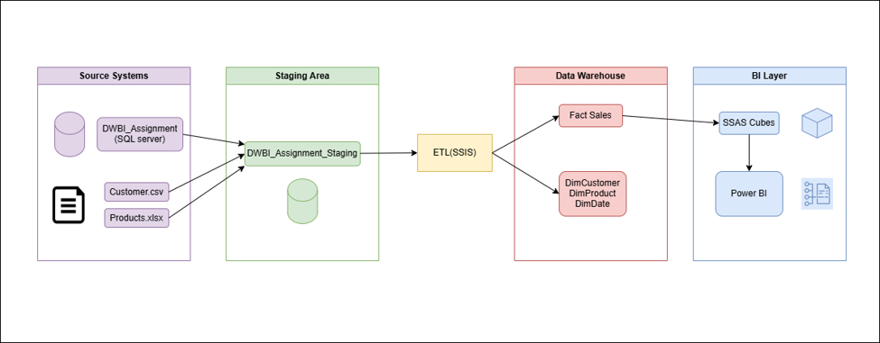
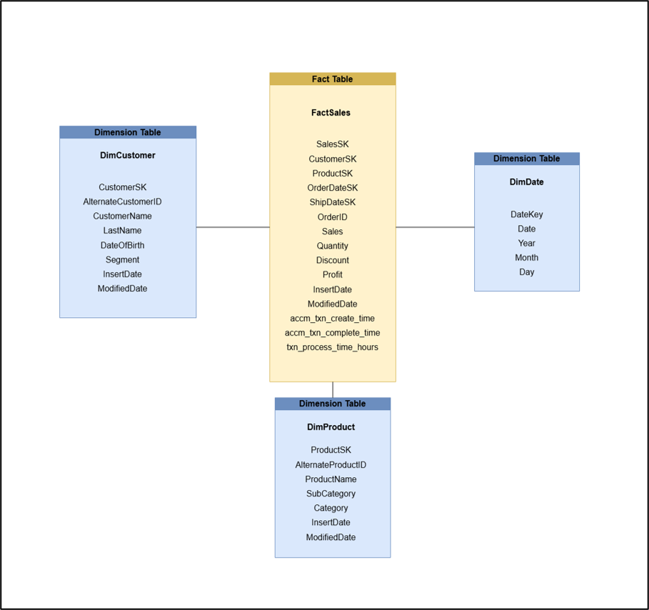
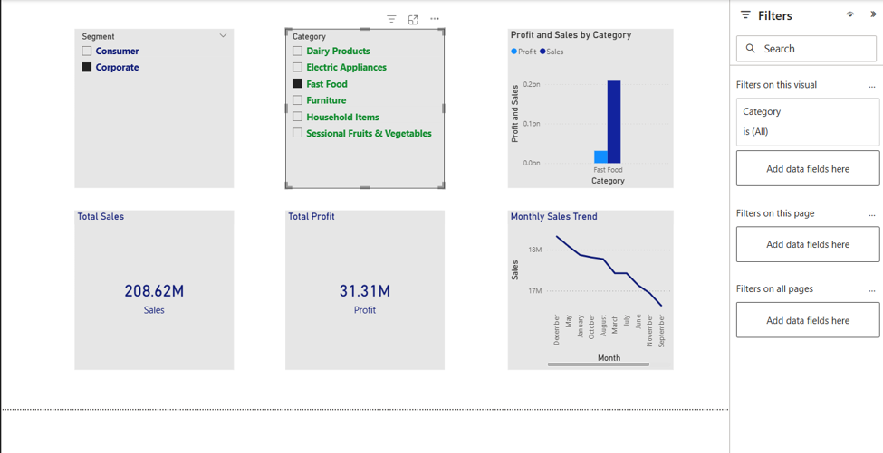
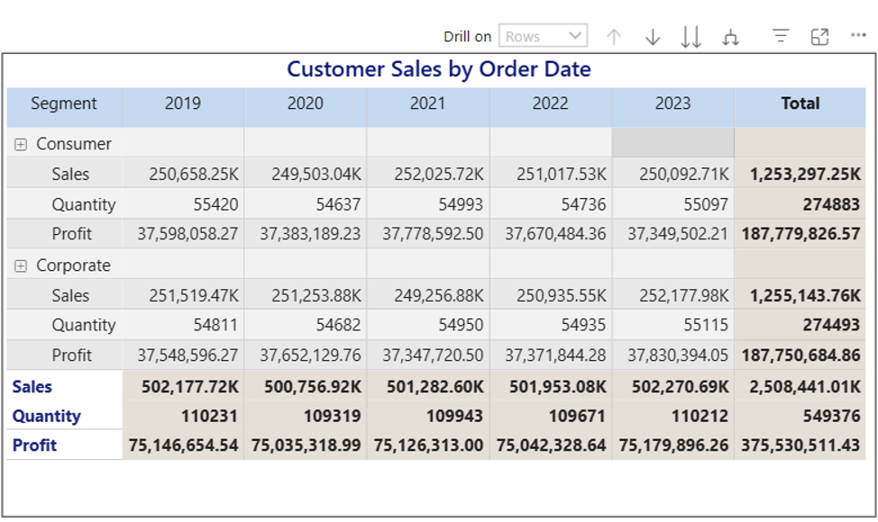

# Retail Analytics Data Warehouse & Business Intelligence Solution


**End-to-end BI Solution** built with **Data Warehousing, SSIS ETL, SSAS OLAP Cube, and Power BI**.



---

## Project Overview

This project transforms raw retail transaction data from heterogeneous sources into actionable business insights. It demonstrates a complete **Data Warehousing and Business Intelligence pipeline** for a simulated Indian retail store.

**Key Outcomes:**
- Integrated multiple data sources (SQL Server, CSV, Excel)
- Built a **Star Schema Data Warehouse**
- Developed robust **SSIS ETL** processes (including Slowly Changing Dimensions & Accumulating Facts)
- Created a **multidimensional SSAS OLAP Cube**
- Demonstrated classic **OLAP operations**
- Built interactive **Power BI reports** with drill-down, drill-through, and cascading filters

---

## Technologies Used

| Technology              | Purpose                                      |
|-------------------------|----------------------------------------------|
| Microsoft SQL Server    | Source DB + Data Warehouse                   |
| SSIS                    | ETL Development                              |
| SSAS (Multidimensional) | OLAP Cube & Multidimensional Analysis        |
| Power BI Desktop        | Interactive Dashboards & Reporting           |
| Excel                   | OLAP Client (PivotTables)                    |
| CSV + Excel Files       | Heterogeneous source systems                 |

---

## Dataset

- **Name**: Indian Store Data
- **Source**: [Kaggle](https://www.kaggle.com/datasets/abuhumzakhani/store-data)
- **Size**: ~100,000 retail transactions
- **Period**: 5 years (2019–2023)
- **Structure**: OLTP-style, intentionally split across **SQL Server + CSV + Excel** to simulate real enterprise environments.

**Source Systems:**
- **SQL Server** (`DWBI_Assignment`): Main transactional data (`StgOrders`)
- **CSV** (`customer.csv`): Customer details
- **Excel** (`product.xlsx`): Product catalog

---

## Solution Architecture

```
Source Systems (SQL + CSV + Excel)
      ↓
Staging Area
      ↓
SSIS ETL Process
      ↓
Data Warehouse
      ↓
SSAS OLAP Cube
      ↓
Power BI Reports
```

Full documentation with screenshots:
- [Assignment 01](Documents/Assignment_01.pdf) — Dataset, Architecture, Star Schema & SSIS ETL
- [Assignment 02](Documents/Assignment_02.pdf) — SSAS Cube, OLAP Operations & Power BI

---

## Data Warehouse Design (Star Schema)



### Fact Table
- **FactSales** — Central fact table with measures (`Sales`, `Quantity`, `Discount`, `Profit`) and accumulating snapshot fields (`accm_txn_create_time`, `accm_txn_complete_time`, `txn_process_time_hours`).

### Dimension Tables
| Dimension     | Surrogate Key     | Business Key             | Key Attributes                     |
|---------------|-------------------|--------------------------|------------------------------------|
| DimCustomer   | CustomerSK        | AlternateCustomerID      | Name, Segment, DOB                 |
| DimProduct    | ProductSK         | AlternateProductID       | Name, Category, Sub-Category       |
| DimDate       | DateKey (YYYYMMDD)| —                        | Year, Month, Day                   |

**Design Highlights**:
- Conformed `DimDate` (shared between Order & Ship Date)
- Surrogate keys for performance
- OrderID retained as natural key for accumulating fact updates

---

## ETL Development (SSIS)

Four modular SSIS packages were developed:

| Package                    | Purpose |
|---------------------------|--------|
| `as_Load_Staging.dtsx`    | Extract from SQL, CSV, Excel → Staging tables |
| `as_Load_DW.dtsx`         | Transform + Load Dimensions & Fact (Lookups, SCD Type 1, Surrogate Keys) |
| `Update_FactSales.dtsx`   | Update accumulating fact attributes using natural key (`OrderID`) |
| `DataProfiling.dtsx`      | Source data quality assessment |

**Key Transformations Used**:
- Data Conversion, Lookup, Conditional Split, Derived Column, OLE DB Command

---

## SSAS OLAP Cube

- **Project**: DWBI Assignment DW (Multidimensional)
- Measures: Sales, Quantity, Discount, Profit
- Hierarchies: `Year → Month → Day` (DimDate), Customer hierarchy
- Successfully deployed and processed

---

## OLAP Operations (Demonstrated in Excel PivotTable)

| Operation   | Description | Example |
|-------------|-----------|--------|
| **Roll-up** | Aggregate to higher level | Month → Year |
| **Drill-down** | Show lower granularity | Year → Month → Day |
| **Slice**   | Single dimension filter | Segment = "Consumer" |
| **Dice**    | Multiple dimension filter | Consumer + Electronics |
| **Pivot**   | Reorient axes | Swap Segment ↔ Year |

---

## Power BI Reports

Connected directly to the SSAS Cube. Four reports were built:

1. **Matrix Visual** – Cross-tab analysis (Product Category × Customer Segment)
2. **Slicers** – Cascading filters + multiple visuals (Column + Line charts, KPIs)
3. **Drill-Down Report** – Hierarchical time analysis (Year → Month → Day)
4. **Drill-Through Report** – Right-click navigation to transaction-level details




---

## Repository Structure


```
Retail-Analytics-Data-Warehouse
│
├── Documents
│   ├── Assignment_01.pdf
│   ├── Assignment_02.pdf
│
├── assets
│   └── images
│       └── retail-dw
│           ├── architecture-diagram.png
│           ├── star-schema.png
│           ├── load-dw.png
│           ├── powerbi-1.png
│           └── powerbi-2.png
│
├── SSIS Packages
├── SSAS Cube Project
├── SQL Scripts
│
└── README.md
```


### Key Skills Demonstrated
- Dimensional Modeling & Star Schema Design
- Multi-source ETL with SSIS (heterogeneous sources)
- Slowly Changing Dimensions & Accumulating Fact Tables
- SSAS Multidimensional Cube Development
- OLAP Operations
- Advanced Power BI (Drill-down, Drill-through, Cascading Slicers)

# Author

**Ishoda Moderage**

BSc (Hons) Information Technology  
Specializing in Data Science  
Sri Lanka Institute of Information Technology (SLIIT)
